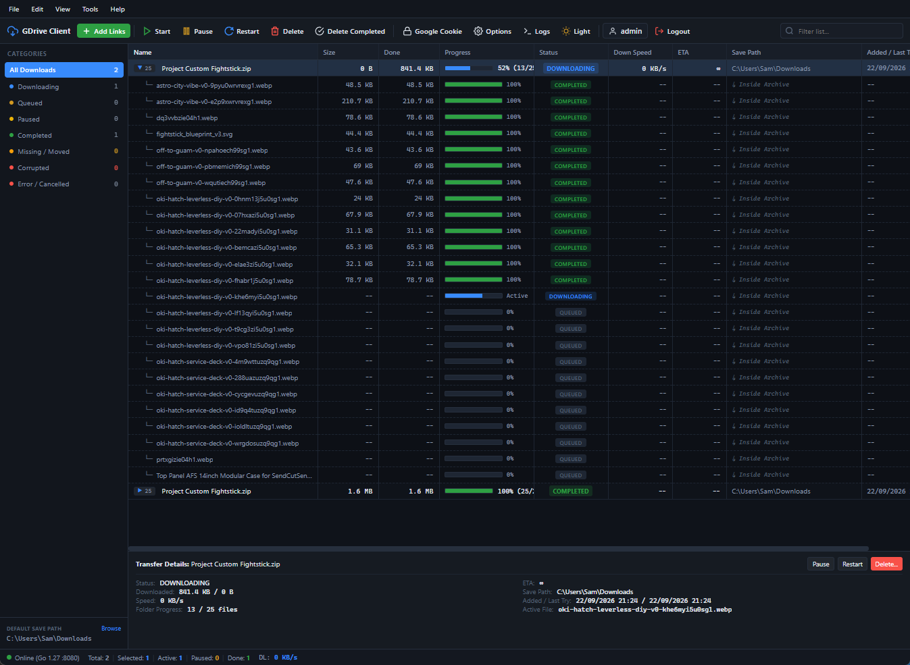
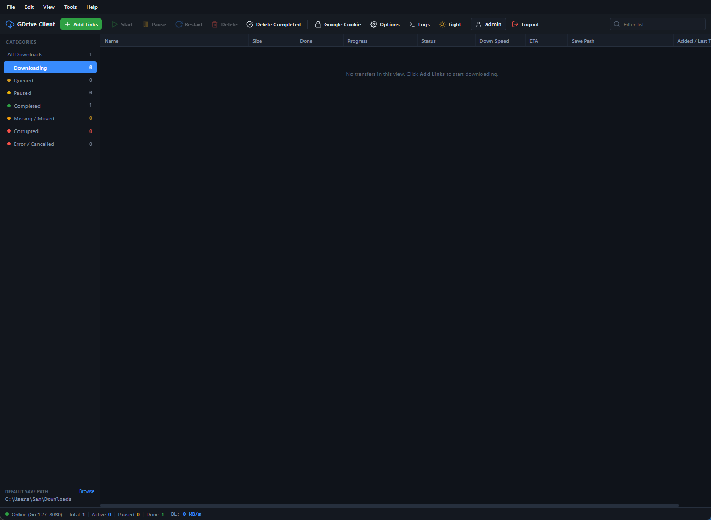

# Google Drive Downloader (Desktop Web Edition)

[](https://golang.org)
[-FF3E00?style=flat&logo=svelte)](https://svelte.dev)
[](https://vitejs.dev)
[](https://www.docker.com)
[](LICENSE)
[](#server-deployment--external-storage-setup)

A high-performance, self-hosted desktop download manager for Google Drive with a native **qBittorrent & Internet Download Manager (IDM)** user interface. Built with a concurrent Go backend and a responsive Svelte 5 frontend. Features batch queuing, folder-to-ZIP compression, real-time file sync, SHA-256 integrity verification, Google session cookies for restricted files, and enterprise-grade Web UI authentication for headless server deployments.

---

## Quick View & Screenshots

### Active Transfers & Real-Time Monitoring

*Desktop-grade transfer grid featuring multi-select, sortable columns, real-time speed/ETA, expandable folder contents, and contextual action toolbar.*

### Clean Dashboard & Desktop Interface

*Modern dark theme with native application menu bar (File, Edit, View, Tools, Help), category sidebar, and Jellyfin-style destination browser.*

---

## Core Features

- **Google Drive & Discord CDN Support**: Download both Google Drive files/folders and Discord CDN attachments (`cdn.discordapp.com` and `media.discordapp.net`).
- **Concurrent Discord Downloads with Rate-Limit Protection**: Download multiple Discord files in parallel with adaptive exponential backoff, request jitter pacing, realistic browser headers, and HTTP Range partial-content resumption against Cloudflare HTTP 429 throttling.
- **Discord Expiry Detection**: Automatically checks the Discord CDN `ex` timestamp and alerts if an attachment link has expired before wasting bandwidth.
- **Anti-Throttle & Cloudflare WARP Auto-Bypass**: Automatically monitors download transfer speeds and CDN HTTP 429 rate limits. When throttling is detected (e.g., speed drops below threshold for 7s), it seamlessly activates a local Cloudflare WARP SOCKS5 proxy or custom proxy pool, rotates WireGuard keys for fresh egress IPs, and reconnects active chunk streams at the exact byte offset.
- **Custom SOCKS5/HTTP Proxy Fallback**: For environments where WARP cannot run, users can configure single or comma-separated lists of custom proxies with automatic round-robin pool rotation.
- **Concurrent Multi-Worker Engine**: Configurable parallel workers (1 to 5) powered by lightweight Go goroutines.
- **Bypass Virus Scan Prompts**: Automatically extracts Google Drive confirmation tokens for large files (>100MB).
- **Smart Folder & ZIP Compression**: Paste any public or private Google Drive folder link. Choose between downloading as a subfolder or compressing all folder contents locally into a verified `.zip` archive with real-time compression progress.
- **Conflict & Duplicate Resolution**: Automatically checks for existing files on disk or duplicate tasks in the queue when pasting links. Provides 3 options: Keep both with auto-suffix `(2)`, Overwrite & Replace, or Re-monitor & Verify integrity with resume support.
- **Real-Time File Presence & Missing Sync**: If files are moved, renamed, or deleted from disk, the application immediately updates their status to `MISSING / MOVED` and provides a 1-click re-download button.
- **Google Cookie Session (Restricted Files)**: Download private files, shared team drives, or files hitting "Download quota exceeded" by pasting your session cookie into the secure Tools menu.
- **Server-Ready Web UI Authentication**: Built-in authentication (qBittorrent-style) protecting your server or VPS from unauthorized access. Supports environment variables (`AUTH_ENABLED`, `AUTH_USER`, `AUTH_PASS`).
- **External HDD & NAS Auto-Detection**: The Jellyfin-style storage browser automatically detects external hard drives and mount points (`/mnt`, `/media`, `/volume1-9`, `D:\`, `E:\`).
- **In-App System Logs**: Real-time diagnostic logger with error filtering, clipboard copying, and live refresh to troubleshoot rate limits or Google network timeouts.
- **Keyboard Shortcuts**: Fully operable via desktop keybindings (`Ctrl+N`, `Ctrl+A`, `Del`, `Shift+Del`, `Space`, `Esc`).

---

## Server Deployment & External Storage Setup

### Option 1: Docker Compose (Recommended for Servers & NAS)

Create a `docker-compose.yml` file on your server:

```yaml
version: '3.8'

services:
  gdrive-downloader:
    image: gdrive-downloader:latest
    build: .
    container_name: gdrive-downloader
    restart: unless-stopped
    ports:
      - "8080:8080"
    # Capabilities & Devices for Cloudflare WARP Local Proxy (Anti-Throttle Watchdog)
    cap_add:
      - NET_ADMIN
    devices:
      - /dev/net/tun:/dev/net/tun
    sysctls:
      - net.ipv6.conf.all.disable_ipv6=0
    environment:
      - PORT=8080
      - HOST=0.0.0.0
      - DOWNLOAD_DIR=/downloads
      - CONFIG_DIR=/config
      - AUTH_ENABLED=true
      - AUTH_USER=admin
      - AUTH_PASS=adminadmin
      # Optional: Add extra paths for the storage browser
      # - EXTRA_DRIVES=/mnt/external_hdd,/mnt/backup
    volumes:
      # 1. State & Configuration (downloads.json & config.json survive reboots)
      - ./config:/config

      # 2. Main download directory
      - ./downloads:/downloads

      # 3. WARP State Persistence (retains client registration & WireGuard credentials)
      - ./warp:/var/lib/cloudflare-warp

      # 4. Mount External Hard Drives, USB drives, or NAS Shares:
      # Linux / Homelab:
      # - /mnt/storage:/mnt/storage:rw
      # - /media/usb:/media/usb:rw
      #
      # Synology NAS (DSM):
      # - /volume1/downloads:/volume1/downloads:rw
      #
      # Unraid / TrueNAS:
      # - /mnt/user/downloads:/mnt/user/downloads:rw
```

Start the service:
```bash
docker compose up -d
```
Access the dashboard at `http://<your-server-ip>:8080`.

#### Cloudflare WARP Setup & Registration Note

The production container includes the official Cloudflare WARP client (`warp-svc` daemon and `warp-cli`).
1. **Initial Registration**: The container automatically registers a free consumer WARP client on first launch (`warp-cli registration new` / `register`).
2. **Docker Capabilities**:
   - `cap_add: [NET_ADMIN]` and `devices: [/dev/net/tun:/dev/net/tun]` are required for `warp-svc` to configure network tunnels.
   - If running inside an **unprivileged LXC container** (e.g. Proxmox VE), ensure `/dev/net/tun` is passed through and `nesting=1,keyctl=1` is enabled on the LXC host (`lxc.mount.entry: /dev/net dev/net none bind,create=dir`).
3. **Teams / Zero Trust Token (Optional)**:
   If you have a Cloudflare Zero Trust organization, you can enroll the container by executing inside the container:
   ```bash
   docker exec -it gdrive-downloader warp-cli teams-enroll <your-team-name>
   ```
4. **Fallback Mode**: If WARP cannot be given `NET_ADMIN` privileges in your environment, the built-in **Custom Proxy Pool** feature (in Settings -> Anti-Throttle) works out of the box without any special capabilities.

---

### Option 2: Linux Systemd Service (VPS / Bare-Metal)

1. Compile the binary or copy `gdrive-downloader` to `/opt/gdrive-downloader/`.
2. Create the systemd service file `/etc/systemd/system/gdrive-downloader.service`:

```ini
[Unit]
Description=Google Drive Downloader Server Daemon
After=network.target

[Service]
Type=simple
User=root
WorkingDirectory=/opt/gdrive-downloader
ExecStart=/opt/gdrive-downloader/gdrive-downloader -port 8080 -dir /mnt/storage/downloads -config /opt/gdrive-downloader/config
Restart=on-failure
RestartSec=5s

# Environment Variables
Environment=PORT=8080
Environment=HOST=0.0.0.0
Environment=AUTH_ENABLED=true
Environment=DOWNLOAD_DIR=/mnt/storage/downloads
Environment=CONFIG_DIR=/opt/gdrive-downloader/config

[Install]
WantedBy=multi-user.target
```

3. Enable and start:
```bash
sudo systemctl daemon-reload
sudo systemctl enable --now gdrive-downloader
sudo systemctl status gdrive-downloader
```

---

### Option 3: External Hard Drive Mounting Guide (Linux / Raspberry Pi)

To make external USB hard drives or external storage permanently accessible:

1. Identify the drive UUID:
   ```bash
   sudo blkid
   ```
2. Create a mount point:
   ```bash
   sudo mkdir -p /mnt/external_hdd
   ```
3. Add to `/etc/fstab` for auto-mounting on boot:
   ```text
   UUID=YOUR-UUID-HERE  /mnt/external_hdd  ext4  defaults,nofail  0  2
   ```
4. Mount the drive:
   ```bash
   sudo mount -a
   ```
5. Google Drive Downloader will automatically detect `/mnt/external_hdd` in the **Browse...** destination picker.

---

## Configuration Reference

You can configure the application via command-line arguments or environment variables:

| Flag | Environment Variable | Default | Description |
| :--- | :--- | :--- | :--- |
| `-port` | `PORT` | `8080` | Port to listen on. |
| `-host` | `HOST` | `0.0.0.0` | IP address to bind to (`0.0.0.0` allows LAN/WAN access). |
| `-dir` | `DOWNLOAD_DIR` | `~/Downloads` | Default folder where files and ZIP archives are stored. |
| `-config` | `CONFIG_DIR` | `.` | Directory where `config.json` and `downloads.json` are stored. |
| `-web` | `WEB_DIR` | auto-detected | Path to the frontend `dist` directory. |
| `-auth` | `AUTH_ENABLED` | `true` | Enable or disable Web UI login authentication (`true`/`false`). |
| `-user` | `AUTH_USER` | `admin` | Initial Web UI username for headless deployments. |
| `-pass` | `AUTH_PASS` | `adminadmin` | Initial Web UI password for headless deployments. |
| - | `EXTRA_DRIVES` | `""` | Comma-separated list of additional storage mount paths. |

---

## REST & Streaming API Documentation

| Endpoint | Method | Description |
| :--- | :--- | :--- |
| `/api/events` | `GET` | **Server-Sent Events (SSE)** stream delivering live download queue state, speed, ETA, and progress. |
| `/api/downloads` | `GET` | Get all active, queued, and completed downloads as JSON. |
| `/api/downloads` | `POST` | Add one or multiple Google Drive URLs. Accepts `{ links: [], target_folder: "", zip_mode: true, conflict_resolutions: {} }`. |
| `/api/downloads/precheck` | `POST` | Fast conflict precheck against active queue and disk before adding. |
| `/api/downloads/{id}/start` | `POST` | Start / resume task. |
| `/api/downloads/{id}/pause` | `POST` | Pause running download. |
| `/api/downloads/{id}/restart`| `POST` | Restart download from the beginning. |
| `/api/downloads/{id}` | `DELETE` | Delete task from list. Supports optional disk deletion: `?delete_file=true`. |
| `/api/downloads/{id}/check` | `POST` | Check real-time file presence on disk. |
| `/api/downloads/check-all` | `POST` | Check disk presence for all files in list. |
| `/api/downloads/clear` | `POST` | Clear completed downloads from list. |
| `/api/folders/resolve` | `POST` | Inspect Google Drive folder contents before adding: `{ url: "..." }`. |
| `/api/fs/browse` | `GET` | Browse server filesystem folders and drives: `?path=/mnt`. |
| `/api/config` | `GET` / `POST` | Read or update settings (Target folder, Concurrency, Google Cookie). |
| `/api/auth/status` | `GET` | Check whether authentication is enabled and current login state. |
| `/api/auth/login` | `POST` | Authenticate into Web UI: `{ username: "", password: "" }`. |
| `/api/auth/logout` | `POST` | Terminate session and invalidate auth token. |
| `/api/auth/password` | `POST` | Change admin username and password. |
| `/api/auth/toggle` | `POST` | Enable or disable Web UI authentication. |
| `/api/gdrive/cookie` | `POST` | Save Google session cookie for quota bypass. |
| `/api/gdrive/logout` | `POST` | Clear saved Google session cookie. |
| `/api/logs` | `GET` / `DELETE` | Fetch or clear execution and error logs. |

---

## Desktop Keyboard Shortcuts

| Shortcut | Action |
| :--- | :--- |
| <kbd>Ctrl</kbd> + <kbd>N</kbd> | Open the **Add Links** modal |
| <kbd>Ctrl</kbd> + <kbd>A</kbd> | Select all items in current category view |
| <kbd>Esc</kbd> | Deselect all items / Close active modal or context menu |
| <kbd>Space</kbd> | Toggle Start / Pause on selected downloads |
| <kbd>Del</kbd> | Open delete prompt for selected downloads |
| <kbd>Shift</kbd> + <kbd>Del</kbd> | Open delete prompt defaulted to **Remove from disk** |
| <kbd>Ctrl</kbd> + Click | Toggle individual row selection |
| <kbd>Shift</kbd> + Click | Select continuous range of rows |
| Right-Click | Open desktop context menu with full controls |

---

## Local Development & Build from Source

### Prerequisites
- **Go 1.22+**: [golang.org/dl](https://golang.org/dl/)
- **Node.js 20+** & **npm**: [nodejs.org](https://nodejs.org/)

### 1. Build the Frontend
```bash
cd frontend
npm install
npm run build
```

### 2. Compile the Backend Binary
```bash
cd ../backend
go build -o gdrive-downloader.exe .
```

### 3. Run the Application
```bash
# On Windows:
.\gdrive-downloader.exe

# On Linux / macOS:
./gdrive-downloader
```

Open `http://localhost:8080` in your web browser.

---

## License
This project is open-source under the [MIT License](LICENSE).
